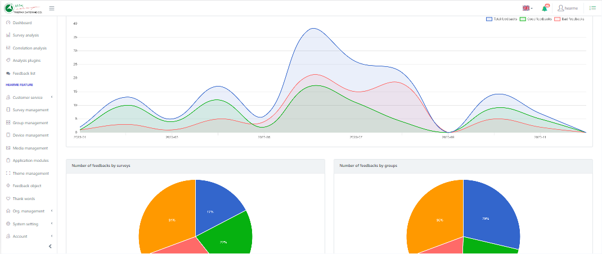
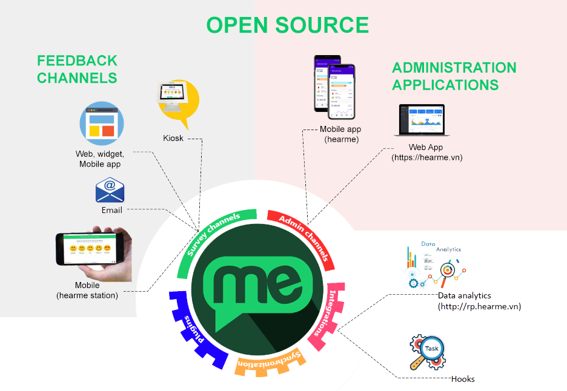

# hearme Zeus 
[](https://hearme.vn)

## Description

The **hearme Zeus** module is an open-source web administration application for managing your entire customer experience system. It is an integral part of the [**hearme**](https://hearme.vn) CXM platform, providing a comprehensive suite of tools for collecting and analyzing customer feedback.

This repository empowers clients to customize the UI, branding, and application logic according to their specific requirements.

**hearme Zeus** integrates seamlessly with other open-source modules for collecting feedback in channels, include [hearme_station](https://github.com/hearme-vn/hearme_station), [cx_mobile](https://github.com/hearme-vn/cx_mobile) and [cx_desktop](https://github.com/hearme-vn/cx_desktop). Leveraging services from the **hearme** platform, hosted on the cloud, it provides a robust suite of tools for configuring your CX system, monitoring, processing feedback, and managing all reporting and analysis data.

By using these hearme open-source modules, you can customize, you can rapidly assemble a complete CXM solution in just a few minutes. Experience the flexibility and speed of customization, and join us in distributing innovative solutions to your local market with [hearme](https://hearme.vn).

## hearme architechture



## Demonstration:
- Kiosk feedback channel: https://www.youtube.com/watch?v=e7KJPQUzvDc
- Online feedback channels:https://www.youtube.com/watch?v=ThOjFk_Ztv8&list=PLFoi8tG0KXO-mViolS5_1orwIA4GZwYid
- You can configure questions, image, and trademark as you want: https://www.youtube.com/watch?v=uzsVHHXlpNY

## Help for developing application:

1. **Full Programming APIs:** [Hearme for Developers APIs version 2.0.1](https://hearme.vn/help/statics/hearme_dev_APIs_v2.0.1.pdf)
2. **Integration for Online feedback Channel:** [Hearme for Online Channel 2.0.1](https://hearme.vn/help/statics/hearme_dev_APIs_ONLINE_v2.0.1.pdf)
3. **Integration for feedback Kiosk:** [Hearme for Kiosk Channel 2.0.1](https://hearme.vn/help/statics/hearme_dev_APIs_SYN_v2.0.1.pdf)
4. **Integration with Zapier:** [Hearme - Zapier Integration](https://hearme.vn/help/statics/hearme-zapier-documentation_202208.pdf)
5. **Help:** [Other integration](https://hearme.vn/help/en/integration/)


# Getting started to collect feedbacks with hearme platform

1. Run this web application
2. Register a **hearme** account at this web app
3. Once you have registered, you can configure your account as steps guided in the onboarding page. Please look for detail information in [help page](https://hearme.vn/help/en/implementation/)
4. You can integrate your system with other administration system. Please refer information at: [Integration](https://hearme.vn/help/en/integration/)


# hearme versions and roadmap

## Version 4.x - Upcoming with AI
- CX Expert Assistant powered by AI for CX practitioners
- Employee Assistant
- Customer Assistant integrated into feedback channels

## version 3.0

Main dependencies for this version:

0. Node: 16.17.0
1. Angular 11.2 (Highest version is 14.0)
2. Core UI: 

- Core 
- Sidebar and menu
- Core UI Icons 
- CoreUI tooltip for chart


3. Chart library

- Chartjs – as base library for charts base on Javascript and html - https://www.chartjs.org/ 
- Ng2-chart: wrapper for chartjs in Angular: https://valor-software.com/ng2-charts/ 
- Plugin for chartjs, making label options: https://github.com/emn178/chartjs-plugin-labels


4. Angular QR Code Generator: https://www.npmjs.com/package/angularx-qrcode
5. ngx-translate: https://github.com/ngx-translate
6. ngx-infinite-scroll: https://www.npmjs.com/package/ngx-infinite-scroll 

# Running application

## Installation
Install the Angular CLI globally using a terminal/console window.

```bash
npm install -g @angular/cli
```

``` bash
$ git clone https://github.com/hearme-vn/hearme-Zeus.git
$ cd hearme-Zeus
# install app's dependencies
$ npm install
```

## Usage
``` bash
# serve with hot reload at localhost:4200.
$ ng serve --open

# For running in specific port:
$ ng serve --open --port port

# build for dev environment with minification
$ ng build

# build for testing system
$ ng build --configuration=staging 

# build for production - use configuration in: environment.prod.ts
$ ng build --prod

#For prevent error on low heap size, run following build command:
node --max_old_space_size=1024 ./node_modules/@angular/cli/bin/ng build --prod
```

To modify configuration for building production, open file: angular.json then change values in 
```
"configurations": {
    "production": {
    }
}
```

# Support information

Whenever you have a support request, you can reach out to Hearme using the following methods:

1. **Help document:** [https://hearme.vn/help/en/](https://hearme.vn/help/en/)
2. **Facebook:** [https://fb.com/hearme.vn](https://fb.com/hearme.vn)
3. **FAQs:** [http://Support.hearme.vn](http://support.hearme.vn)
4. **Email for assistance:** [contact@hearme.vn](mailto:contact@hearme.vn)
5. **Website:** https://hearme.vn

## Creator
- Thuc VX <thuc@hearme.vn>
- Linkedin: https://www.linkedin.com/in/thuc-vu-xuan-825280a6/ 
- LabsOfThings: http://labsofthings.com

